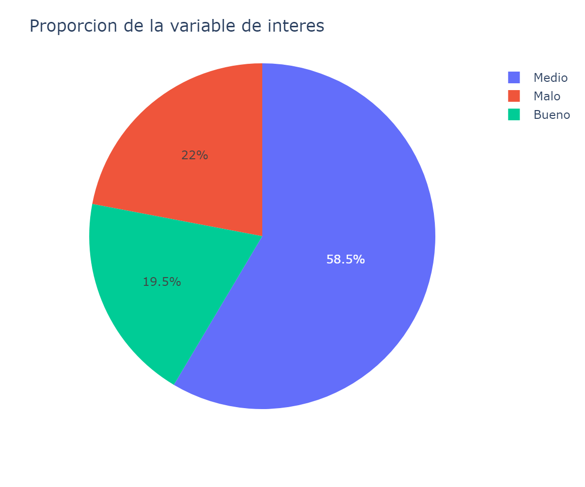
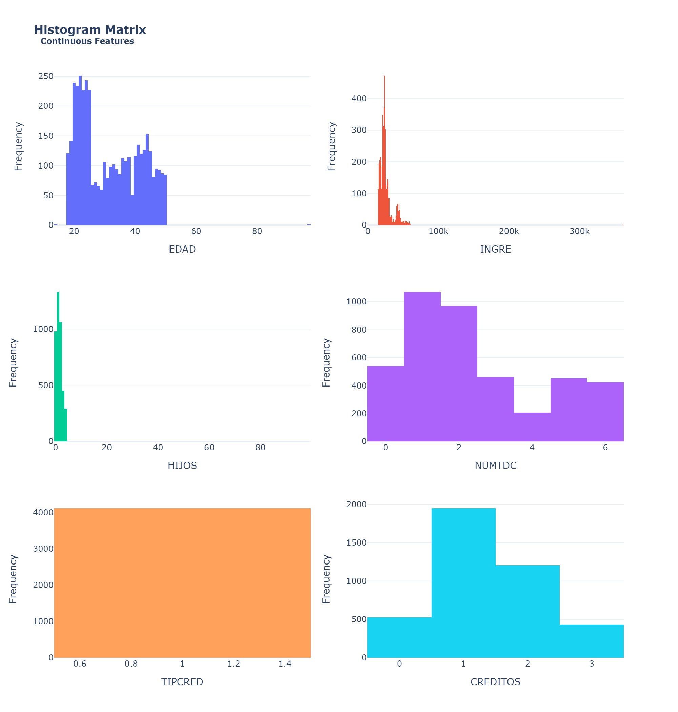
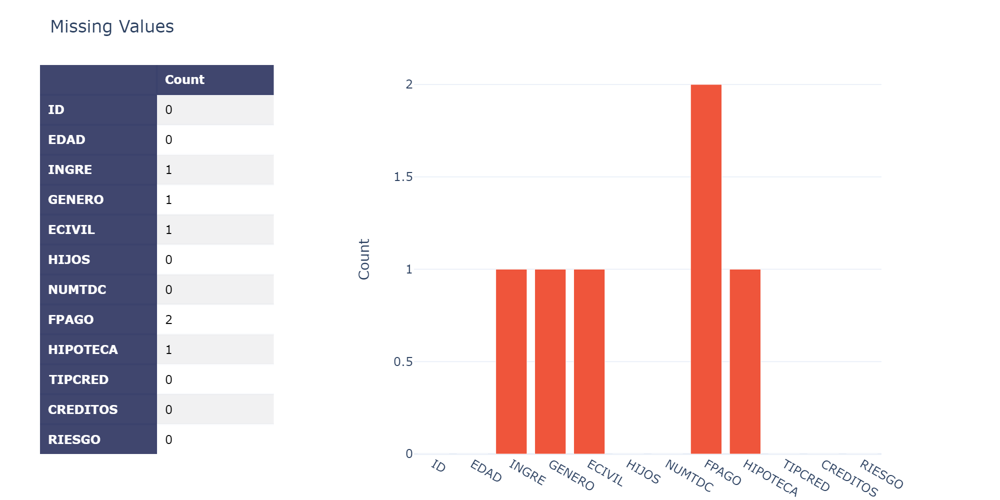
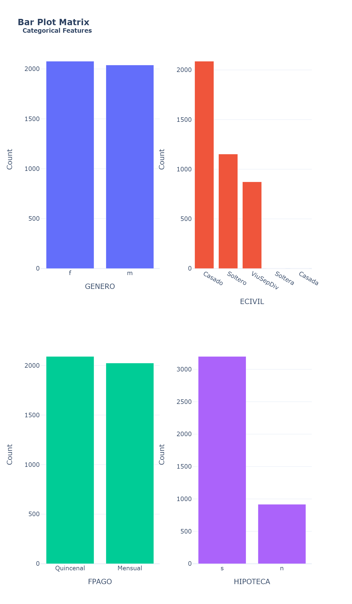
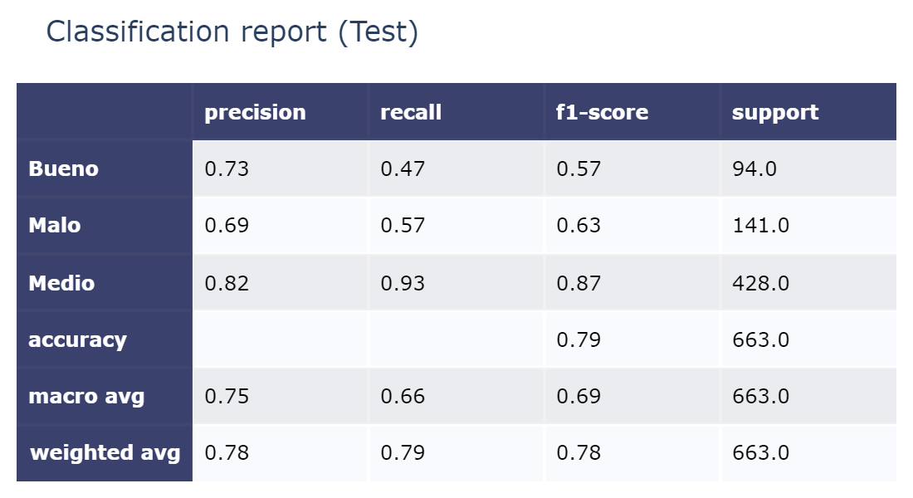
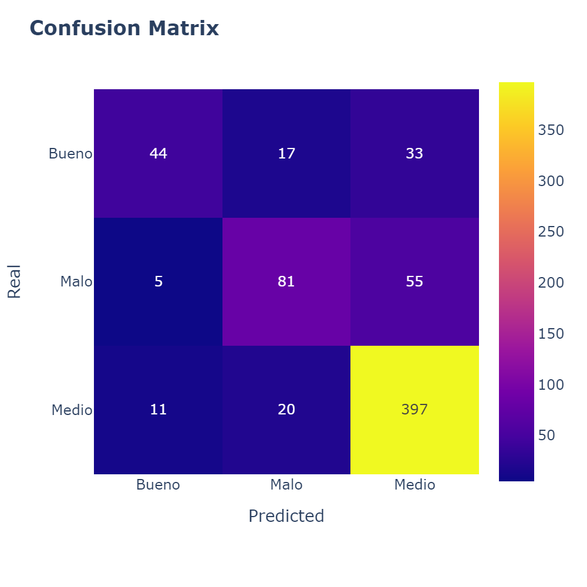

# Analisis de riesgos en clientes

Este es problema de clasificación que se me compartio en una prueba técnica; El objetivo es clasificar al cliente como con riesgo "malo", "medio" y "bueno". No se me compartio información adicional mas que el conjunto de datos. El conjunto de datos se me hizo llegar como un archivo .xlsx el cual manipule con Pandas en Python. 

# Descripción del dataset
El dataset contiene diferentes caracteristicas continuas y discretas; Algunas de las caracterisiticas son la cantidad de hijos, el numero de hipotecas, ingresos, genero, estado civil, etc.

# Analisis exploratorio y preprocesamiento

- Conjunto de datos desbalanceado
  

- Caracteristicas con outliers

- Duplicados
- Valores nulos 

- Etiquetas mal anotadas
- Clases nulas (raras)

  

# Modelado

- AdaBoost
- RandomForest
- XGBoost

# Evaluación
De acuerdo a los resultados mostrados en la tabla y matriz de confusión, el modelo AdaBoost proporciona 79% de exactitud; Hay que notar que el desbalanceo visto anteriormente se hace presente en la metrica de sensibilidad (recall) de la clase Bueno y Malo.

De la misma forma, en f1-score la clase Bueno y Malo se mantiene en un valor bajo.

# Despliegue
Proximamente...

> [!NOTE] 
> Adicional a lo anterior, una vez obtenido un conjunto de datos limpio y listo para modelar, este conjunto de datos fue cargado a una instancia blob storage en Azure para su modelado con AzureML Studio. El objetivo fue analizar y comparar las ventajas, siendo una de ellas el facil despliegue en la nube como API REST.

